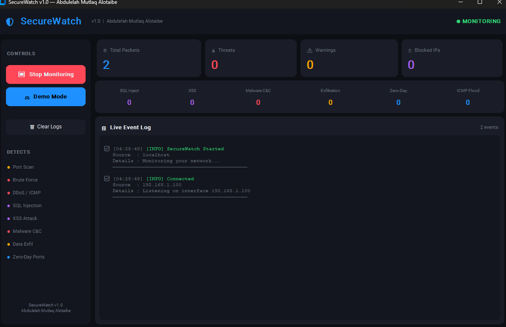
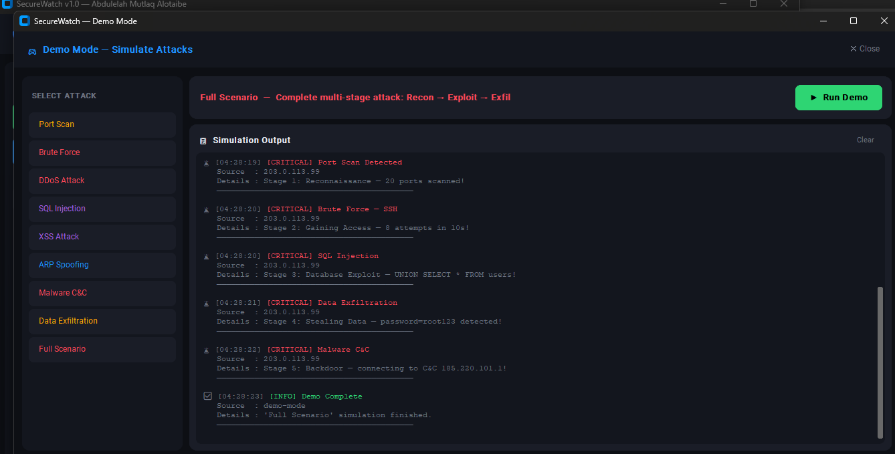

#  SecureWatch v1.0
### Intrusion Detection System (IDS)

> **Author:** Abdulelah Mutlaq Alotaibe  
> **Version:** 1.0  
> **Platform:** Windows 10 / 11  
> **Language:** Python  

---

##  Screenshots

### Main Dashboard — Live Monitoring


### Demo Mode — Full Attack Scenario Simulation


---

##  What is SecureWatch?

SecureWatch is a real-time **Network Intrusion Detection System (IDS)** built with Python.  
It monitors your network traffic and instantly alerts you when it detects suspicious or malicious activity.

---

##  What Does It Detect?

| Threat | Description |
|--------|-------------|
|  **Port Scan** | Attacker rapidly scanning your network ports |
|  **Brute Force** | Repeated login attempts on SSH / RDP / FTP |
|  **DDoS Attack** | Flood of packets overwhelming your server |
|  **SQL Injection** | Malicious SQL patterns in network payloads |
|  **XSS Attack** | JavaScript injection attempts |
|  **ARP Spoofing** | Man-in-the-Middle attack on local network |
|  **Malware C&C** | Device communicating with known malware servers |
|  **Zero-Day Ports** | Connections to backdoor / RAT ports |
|  **Data Exfiltration** | Sensitive data (passwords, API keys) leaving your system |
|  **ICMP Flood** | Ping flood attack |

---

##  Demo Mode

Don't have Administrator access? No problem!  
SecureWatch includes a **Demo Mode** that simulates all attack types so you can see exactly how the system works — no admin required.

**Available simulations:**
- Port Scan
- Brute Force
- DDoS Attack
- SQL Injection
- XSS Attack
- ARP Spoofing
- Malware C&C
- Data Exfiltration
- **Full Scenario** ← Complete multi-stage attack (Recon → Exploit → Exfil)

---

##  Requirements

- Windows 10 or 11
- Python 3.7+
- `customtkinter` library

---

##  How to Run

### Option A — Run from source (PyCharm)

**1. Install requirements:**
```bash
pip install customtkinter
```

**2. Run:**
```bash
python SecureWatch.py
```

>  Right-click PyCharm → **Run as Administrator** for real monitoring

---

### Option B — Build your own .exe

**1. Install build tools:**
```bash
pip install customtkinter pyinstaller pillow
```

**2. Double-click `build.bat`**

**3. Find `SecureWatch.exe` in the same folder — done!**

---

##  Project Structure

```
SecureWatch/
├── SecureWatch.py        ← Main application
├── make_icon.py          ← Icon generator
├── build.bat             ← Build to .exe
├── screenshot_main.png   ← Dashboard screenshot
├── screenshot_demo.png   ← Demo Mode screenshot
└── README.md             ← This file
```

---

##  Important Notes

- This tool is for **educational purposes** and use on **your own network only**
- Do **not** use on networks you don't own or have permission to monitor
- Real-time monitoring requires **Administrator privileges**
- Demo Mode works without any special permissions

---

##  License

This project is for educational use only.  
© 2026 Abdulelah Mutlaq Alotaibe — All rights reserved.
